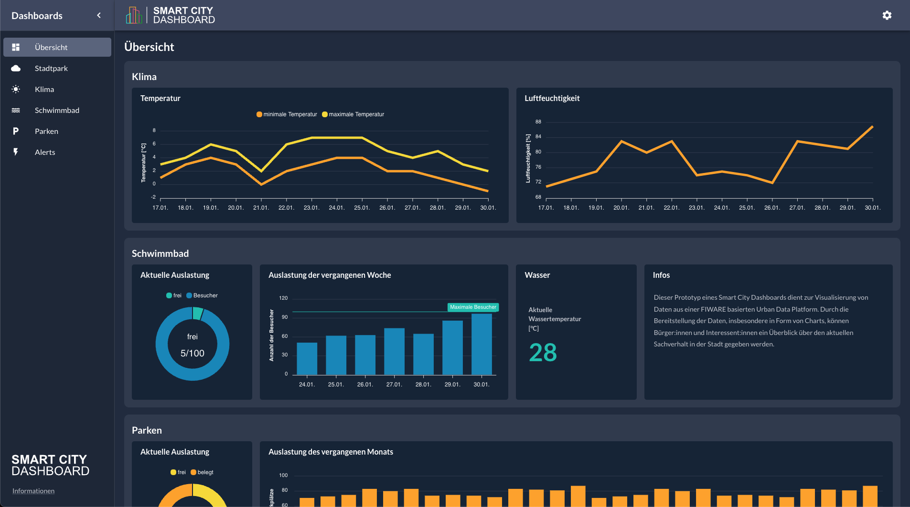
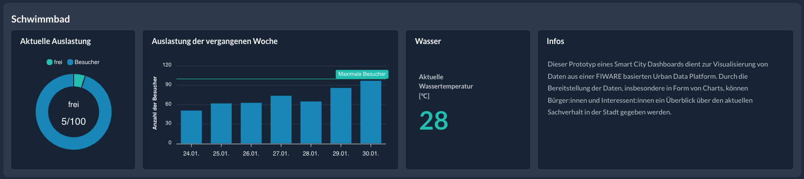
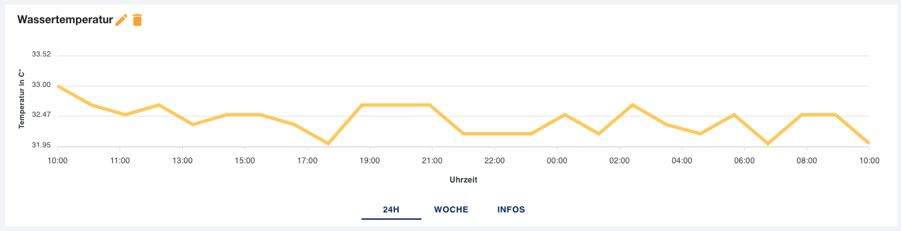
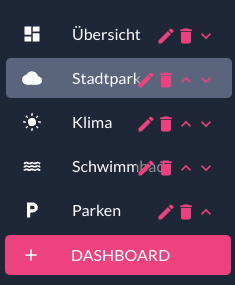
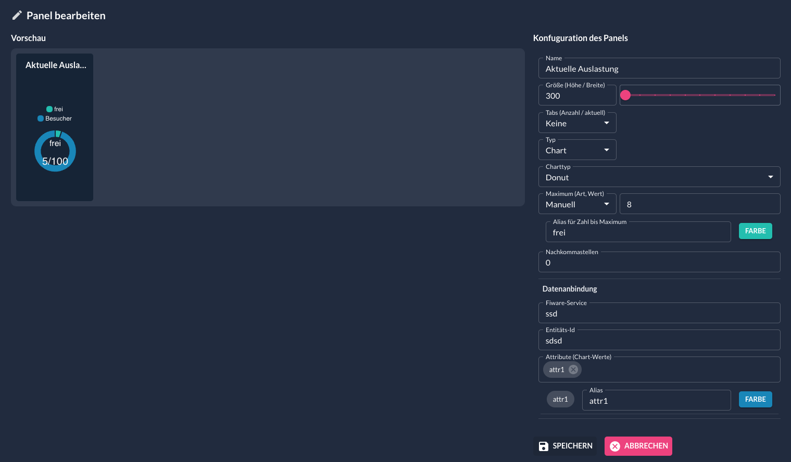
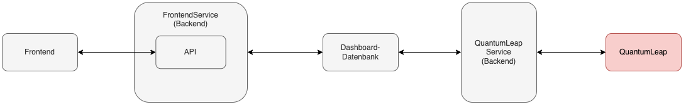

# Smart City Dashboard

Das Ziel dieses prototypischen Projekts ist die Visualisierung von Daten aus der [FIWARE](https://www.fiware.org/)-basierten zentralen Open Data Plattform. Durch die Bereitstellung der Daten, insbesondere in Form von Charts, kann Bürger:innen und Interessenten ein Überblick über den aktuellen Sachverhalt in der Stadt gegeben werden. So ist es beispielweise möglich einzusehen, wie viele Besucher sich aktuell im Maspernbad befinden oder welche Temperatur- und Luftfeuchtigkeitswerte durch Sensoren in verschiedenen Stadtteilen gemessen werden.

Welche Daten wie visualisiert werden sollen kann dabei von den Betreibern im Livebetrieb und ohne zusätzlichen Programmieraufwand angepasst werden. Das ist möglich, indem Sie sich als Administrator anmelden und über einen integrierten Wizard die gewünschte Konfiguration vornehmen. Folglich können neu in die Open Data Plattform eingespiesene Daten durch minimale Anpassungen direkt der Öffentlichkeit zugänglich gemacht werden. Die Daten liegen also nicht nur in der Plattform ab, sondern bieten allen Einwohner:innen einen direkten Mehrwert.

Die oben ersichtiche Webseite setzt sich hauptsächlich aus dem Menü links und dem Hauptbereich des jeweiligen Dashboards rechts davon zusammen. Über das Menü können Nutzer:inner das gewünschte Dashboard wählen und werden über die entsprechende Url zur Unterseite der Single-Page-App weitergeleitet. Der Content Bereich rechts ist in Widgets unterteilt, welche wiederum Panels enthalten. So sind die Panels thematisch gegliedert. Auf mobilen Geräten wird das Menü standardmäßig eingeklappt und Widgets und Panels werden entsprechend der Bildschirmbreite umgebrochen, um den begrenzten Platz auf den kleineren Bildschirmen optimal auszunutzen.

## Beschreibung der Inhalte

Es folgt eine kurze Beschreibung der wichtigsten Elemente der Webseite, mit Einblicken in die jeweiligen Konfigurationsmöglichkeiten.

### Panels

Der Prototyp ermöglicht momentan das Erstellen von Panels in drei verschiedenen Typen.

- Beschreibende Panels enthalten Text und können somit beispielsweise dazu verwendet werden um Daten zu beschreiben.
- Werte Panels enthalten bis zu zwei aktuelle Werte. Dabei kann es sich entweder um Einzelwerte einer Entität handeln, oder um Durchschnitts-, Minimal-, Maximal- oder Summenwerte, die anhand mehrerer Entitäten berechnet werden.
- Chart Panels visualisieren Informationen anhand von mit [APEXCHARTS](https://apexcharts.com/) erzeugten Diagrammen. Es werden drei Chart-Typen unterstützt.
  - Donut Charts zeigen Werte in Bezug zu einem bestimmten Maximum und eignen sich damit z. B. gut zur Anzeige von Auslastungen. Falls Entitäten nur ein zur Anzeige relevantes Attribut enthalten kann der Maximalwert manuell festgelegt werden.
  - Balken Charts visualisieren historische Werte durch Balken. Diese haben ihren Ursprung immer am Nullpunkt und eignen sich deshalb am besten zur Darstellung von Daten mit hohen Wertschwankungen, wie beispielsweise Besucherzahlendaten sie haben. Während das Maximum bei Donut Charts im Chart impliziert ist, kann bei Balken Charts unabhängig von den Daten ein manueller Maximalwert definiert werden.
  - Linien Charts zeigen ebenfalls historische Werte und ähneln sich von ihrer Funktionsweise sehr mit den Balken Charts. Ein wesentlicher Unterschied ist aber, dass Werte nicht beim Nullpunkt beginnen, womit sich Linien Charts besser zur Visualisierung kleinerer Wertschwankungen eignen. So können durch Liniendiagramme z. B. Temperaturschwankungen von wenigen Grad aufgezeigt werden.

Der Titel der Panels ist jeweils optional und außer bei Werte Panels kann noch eine weitere Unterteilung in bis zu drei Tabs vorgenommen werden. Diese Unterteilung ermöglicht es beispielsweise, in einem Panel bestimmte Werte über verschiedene Zeiträume darzustellen und die Daten zu beschreiben.

### Menü

  

Das ein- und ausklappbare Menü enthält alle verfügbaren Dashboards. Außerdem enthält es einen Informationsreiter, in dem Informationen zum Impressum, zur Datenschutzerklärung und zu den Nutzungsbedingungen auffindbar sind. Der Reiter ist im Bild oben nicht enthalten, dafür ist ersichtlich, dass das Menü editiert werden kann. Administrator:innen haben die Möglichkeit die Reihenfolge der Dashboards durch die Pfeile anzupassen, durch die Mülleimer zu löschen oder sie durch den Stift zu editieren.  
Zum Editieren öffnet sich wie beim Klick auf "Neues Dashboard" ein Popup. In diesem Popup können das Icon, der Name und die Url des jeweilgen Boards angepasst werden. Zudem können Boards unsichtbar geschaltet werden (wie das "test"-Dashboard im Bild), was es Administrator:innen ermöglicht diese zu testen, bevor sie veröffentlicht werden.

### Wizard

Alle konfigurierbaren Komponenten der Webseite können wie beim Menü beschrieben durch die Knöpfe angepasst werden. Immer wenn der Stift zum Editieren oder ein Button zum Erstellen einer neuen Komponente geklickt wird, öffnet sich ein entsprechender Konfigurations-Wizard. Der mit Abstand umfangreichste von diesen ist der Panel-Wizard.

Der Panel-Wizard ist zweigeteilt. Auf der rechten Seite befinden sich alle Konfigurationsmöglichkeiten, die der jeweilige Paneltyp bieten kann. Änderungen die in diesem Teil durchgeführt werden wirken sich in Echtzeit auf die Vorschau auf der linken Seite des Wizards aus (zumindest bei Änderungen, die keine vorherige Kommunikation mit dem Backend erfordern).

Folgende Parameter können bei Paneln angepasst werden.

- **Name** (Titel des Panels, optional)
- **Höhe** (in Pixeln, min. 150) und **Breite** (im Gridsystem, Werte von 2 - 12 sind zulässig, wobei von zu gering gewählten Breiten abgeraten wird um visuelle Ungereimtheiten zu vermeiden)
- **Tabs** (keine, 2 oder 3), falls die Anzahl der Tabs größer als 1 ist, entsteht am unteren Rand des Panels ein Reiter zum Tabwechsel und die Namen der Tabs können zusätzlich konfiguriert werden. Außerdem erscheint ein Eingabefeld zur Auswahl des aktuellen Tabs und alle Konfigurationen darunter beziehen sich jeweils nur auf den aktuellen Tab.
- **Typ** (entweder Beschreibung, Chart oder Wert(e) - wobei Werte(e) nur zur Auswahl steht, wenn keine Tabs gewählt sind), da sich der Wizard je nach gewähltem Typ anpasst, beziehen sich die folgenden Parameter auf den jeweiligen Typ.
  - *Beschreibung*
    - **Beschreibungstext** (Textfeld), ermöglcht die Eingabe langer Beschreibungstexte, da der Text innerhalb des Panels scrollt, wenn er zu viel Platz einnimmt.
  - *Chart*
    - **Charttyp** (Donut, Säulen oder Linien)
    - **Zeitraum** (letze 24h, letzte 7 Tage oder letzte 30 Tage. Wird nur bei historischen Charts (Säulen und Linien) eingeblendet), der Zeitraum aus dem die Daten vom QuantumLeap-Service aus der Open Data Plattform bezogen werden sollen.
    - **Y-Beschriftung** (Label der Y-Achse. Wird nur bei historischen Charts (Säulen und Linien) eingeblendet)
    - **X-Beschriftung** (Label der X-Achse. Wird nur bei historischen Charts (Säulen und Linien) eingeblendet)
    - **Maximum** (Auswahl zwischen automatisch und manuell. Bei der Auwahl von "Manuell" wird der Maximalwert, der Alias für die Zahl bis zum Maximum und die gewünschte Farbe angegeben)
    - **Nachkommastellen** (0 - 5, Anzahl der maximalen Nachkommstellen der Werte im Chart)
    - *Datenanbindung:* Die folgenden Parameter werden vom QuantumLeap-Service verwendet um Daten zu beziehen. Deshalb sind nur valide Eingaben erlaubt, sprich: Unerlaubte Sonderzeichen und dergleichen werden nicht übernommen.
    - **Fiware-Service** (der verwendete Fiware-Service)
    - **Entitäts-Id** (die Id der Entität, deren Attribut(e) visualisert werden sollen)
    - **Attribute** (1 - n, die Attribute deren Daten zu Befüllung der Charts verwendet werden), jedes eingegebene Attribut muss mit Enter bestätigt werden. Erst nach der Bestätigung einer validen Eingabe erscheint unter dem Feld eine weitere Konfigurationsmöglichkeit für jedes Attribut. In dieser können der Alias und die Farbe angepasst werden.
  - *Wert(e)*
    - **Werte** (1 oder 2), bei zwei Werten erscheint ein Eingabefeld zur Auswahl des aktuellen Werts (ähnlich wie bei der Auswahl der Anzahl der Tabs).
    - **Modus** (Aktueller Wert, Durchschnitt, Summe, Minimum oder Maximum), wird ein anderer Modus als "Aktueller Wert" gewählt, werden die Attribute von mehreren Entitäten bezogen. Dies funktioniert also etwas gegensätzlich zu den Charts (bei diesen können aus einer Entität mehrere Attribute bezogen werden, bei den Werten kann aus mehreren Entitäten ein Attribut bezogen werden).
    - **Nachkommastellen** (0 - 5, Anzahl der maximalen Nachkommstellen der Werte)
    - *Datenanbindung:* Die folgenden Parameter werden vom QuantumLeap-Service verwendet um Daten zu beziehen. Deshalb sind nur valide Eingaben erlaubt, sprich: Unerlaubte Sonderzeichen und dergleichen werden nicht übernommen.
    - **Fiware-Service** (der verwendete Fiware-Service)
    - **Entitäts-Id(s)** (die Id(s) der Entität(en), deren Attribut(e) visualisert werden sollen), Vorsicht: Falls ein Attribut von mehreren Entitäten bezogen wird, verwandelt sich die Eingabe in eine Multieingabe und einzelne Ids müssen mit Enter bestätigt werden!
    - **Attribut** (das Attribut, aus dessen Daten die Werte erhoben werden)
    - **Wertname** (beschreibender Titel für den Wert)

## Architektur des Projekts

Grob unterteilt besteht der Prototyp aus einem Frontend und einem Backend. Das Frontend visualisiert die Daten, die es vom Backend erhält. Das Backend bezieht die Daten durch einen intelligenten Polling-Mechanismus aus der Open Data Plattform und speichert diese zwischen, wodurch die Last auf die Plattform minimal gehalten wird.

- Bei der Webseite (dem Frontend) handelt es sich um eine mit [React](https://reactjs.org/) erstellte Single-Page-App.
- Das zugehörige Backend besteht aus zwei separat agierenden [Express](https://expressjs.com/de/) Anwendungen, die eine [MongoDB](https://www.mongodb.com/) Datenbank verwenden.
  - Der Frontend-Service ist für die Verarbeitung jeglicher Anfragen des Frontends zuständig.
  - Der QuantumLeap-Service ist für das Abrufen der Daten aus der Open Data Plattform zuständig.
  - In der MongoDB werden sämtliche relevanten Daten gehalten: Die Nutzerdaten, Dashboarddaten und Querydaten.

## Funktionsweise und Datenflüsse der Projektkomponenten

Zur Veranschaulichung der Funktionsweise der Projektkomponenten sind nachfolgend die drei wichtigsten Datenflüsse beschrieben.

- **User Datenfluss**  
Wenn Nutzer:innen durch eine Url ein bestimmtes Dashboard aufrufen, wird eine entsprechende Anfrage vom Frontend an den Frontend-Service gesendet. Falls das Dashboard existiert, wird es vom Frontend-Service aus der Datenbank geholt. Da die gesamte Gestaltung des Dashboards von Administratoren (im Livebetrieb) angepasst werden kann, wird hierbei die Seitenstruktur geladen. Was in der Struktur allerdings nicht enthalten ist, sind die Daten, die aus der Open Data Plattform bezogen wurden. Diese befinden sich in einer gesonderten Kollektion in der Datenbank und werden über Referenzen der Struktur hinzugefügt.  
Dies ermöglicht das Aktualisieren des Datenstands parallel zur Abfrage des selbigen, sprich: Wenn für ein Dashboard Daten benötigt werden, kann immer der letzte Stand dieser Daten verwendet werden. Erst nach erfolgreichem Abruf und Verarbeitung der aus der Open Data Plattform stammenden Daten werden diese in der Datenbank erneuert. Somit werden Verzögerungen verhindert und sobald aktuelle Daten vorliegen werden diese ohnehin den Nutzer:innen präsentiert, wenn sich die Seite das nächste Mal im Hintergrund aktualisert.

- **Admin Datenfluss**  
Zusätzlich zu den Abläufen bei Standard Nutzer:innen wird beim Anmelden von Admins geprüft, ob die nötigen Berechtigungen in der entsprechenden Datenbank-Kollektion gespeichert sind. Ist dies der Fall, erhalten die Administrator:innen ein Token, durch welches sie Inhalte der Webseite ändern können.  
So kann z. B. ein Panel angelegt werden, welches neue Daten aus der Open Data Plattform visualisieren soll. Wenn diese Änderung von den Administrator:innen durch das Speichern im Frontend bestätigt wird, wird sie an den Frontend-Service übermittelt. Dieser speichert die aktualisierte Dashboard-Struktur in die Dashboard-Kollektion der Datenbank und referenziert eine neue Query, die in der Query-Kollektion angelegt wird. Nun kann den Administrator:innen das aktuelle Dashboard übermittelt werden, was somit die durchgeführte Änderung beinhaltet.

- **Caching Datenfluss**  
Der Frontend-Service und QuantumLeap-Service agieren wie erwähnt gesondert. Die einzige benötigte gemeinsame Schnittstelle ist die Datenbank. Ein Scheduler des QuantumLeap-Service prüft in regelmässigen Abständen, ob Datenstände in der Query-Kollektion der Datenbank leer oder veraltet sind. Nur wenn dies der Fall ist, resultiert daraus eine Anfrage an die QuantumLeap-API der Open Data Plattform.  
Infolgedessen können beispielsweise die Daten für einen Donut-Chart, der die aktuelle Auslastung anzeigen soll, bei jedem Durchgang aktualisiert werden während die Daten für ein historisches Säulendiagramm nur jede Stunde aktualisert werden, da keine hohe Frequenz zur Visualiserung der Daten der letzten 30 Tage benötigt wird.  
Da Abfragen über einen längeren Zeitraum mehr Daten enthalten, impliziert diese Umsetzung eine intelligente Verminderung der Last auf QuantumLeap und den QuantumLeap-Service.
